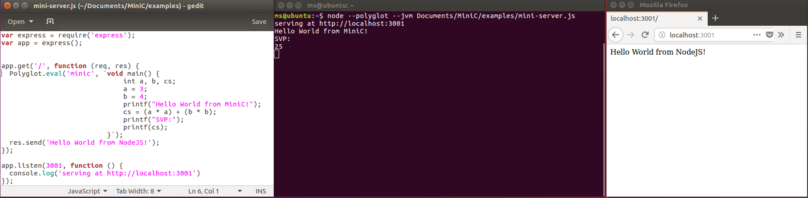

# MiniC

MiniC is a very basic programming language using the Truffle DSL for the GraalVM.

## Prerequisites

* JDK 8
* Maven3
* An installed and configured **GraalVM** <http://www.graalvm.org/docs/getting-started/>

## How to run

* `git clone https://github.com/schalkms/MiniC`
* `mvn package`
* Execute `./mc examples/hello-world.minic` to run a MiniC language source file
* [IDE Setup](http://www.graalvm.org/docs/graalvm-as-a-platform/implement-language/)

## Install MiniC into GraalVM

MiniC can be installed into GraalVM with the following commands.

```shell
mvn package
<<graalvm-path>>/bin/gu -F install <<MiniC-clone>>/component/mc-component.jar
```

### Combining C and MiniC

`examples/hello-minic.c` shows an example which combines C and MiniC.

```shell
clang -g -O1 -c -emit-llvm -I<<graalvm-path>>/jre/languages/llvm examples/hello-minic.c
./<<graalvm-path>>/bin/lli --polyglot --jvm hello-minic.bc
```

### Combining JavaScript and MiniC

`examples/mini-server.js` shows an example which combines JavaScript and MiniC.

```shell
<<graalvm-path>>/bin/node --polyglot --jvm examples/mini-server.js
```



## License

GNU General Public License v3.0

<https://www.gnu.org/licenses/>
